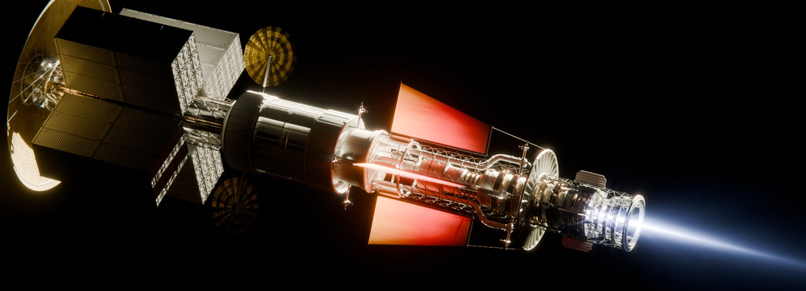

<table width="100%" border="0" cellspacing="0" cellpadding="0">
  <tr>
    <td align="left" valign="middle">
      
    </td>
  </tr>
</table>

# Hi, I'm James Rhodes

Year 13 A-Level student (Predicted A* A* A* A) interested in **aerospace engineering, embedded systems and guidance, navigation & control (GNC).**

---

## 🚀 Projects:

- 🚀 **[Hyades](https://github.com/thejamesrhodes/hyades-flight-computer)** — Active roll-controlled sounding rocket using custom STM32 avionics and GNC software.
- 🛰 **[STM32 Flight Computer](https://github.com/thejamesrhodes/hyades-flight-computer)** — Four-layer STM32H743 avionics with GPS, IMU, barometer and USB High-Speed logging.
- 📡 **[MEMS Gyroscope Research](https://github.com/thejamesrhodes/IMU-Quantisation-research-project)** — Quantisation effects in MEMS gyroscopes (preprint in preparation).
- 🛠 **[Fly-Away Rail Guides](https://github.com/thejamesrhodes/Rocketry-Fly-Away-Rail-Guides-)** — Flight-tested 3D-printable launch rail guides.

➡️ **See the pinned repositories below for code, CAD, hardware and documentation.**

---

🎨 **Aerospace Visualisation:** [ArtStation Portfolio](https://www.artstation.com/sphinx123)
