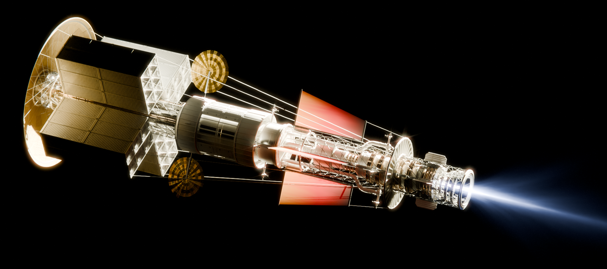

<table width="100%" border="0" cellspacing="0" cellpadding="0">
  <tr>
    <td align="left" valign="middle">
      
    </td>
  </tr>
</table>

# Hi, I'm James Rhodes

Year 13 A-Level student (Predicted A* A* A* A) interested in **aerospace engineering, embedded systems and guidance, navigation & control (GNC).**

---

## 🚀 Projects:

- 🚀 **Hyades** — Active roll-controlled sounding rocket using custom STM32 avionics and flight software.
- 🛰️ **Flight Computer** — Four-layer STM32H743 avionics with GPS, IMU and USB High-Speed logging.
- 📡 **MEMS Gyroscope Research** — Quantisation error investigation with custom hardware (preprint in preparation).
- 🛠️ **Fly-Away Rail Guides** — Flight-tested 3D-printable launch rail guides for model rockets.

➡️ **See the pinned repositories below for code, CAD, hardware and documentation.**

---

**Tools:** Embedded C • MATLAB • Python • STM32 • KiCad • SOLIDWORKS • XFLR5 • OpenVSP • Blender

🎨 **Aerospace Visualisation:** https://www.artstation.com/sphinx123
